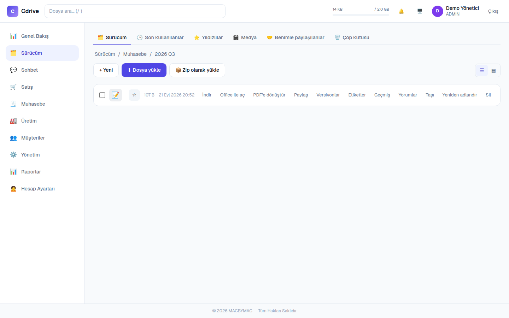
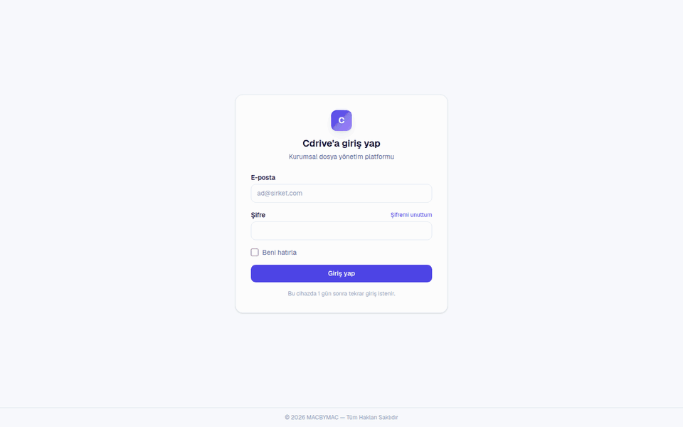
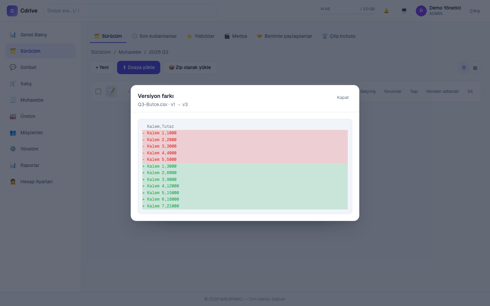
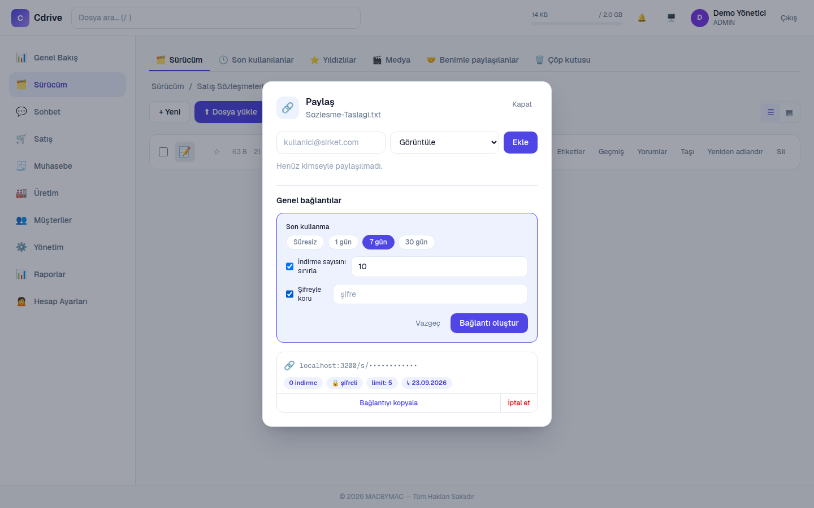
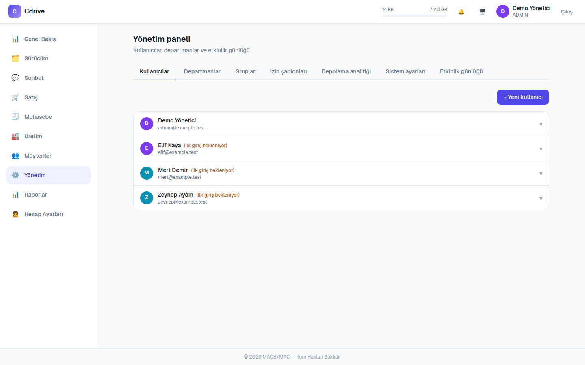
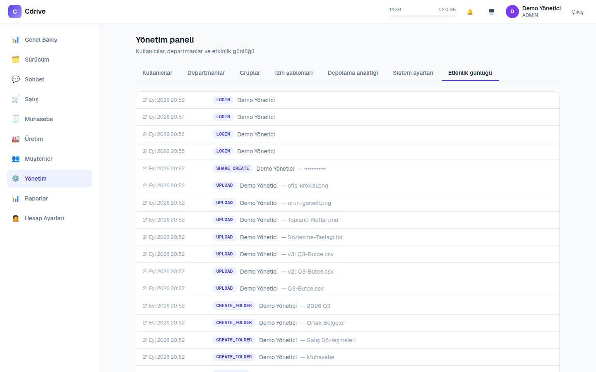

<div align="center">

# CDrive

### Kurumsal dosyalarınız. Kendi sunucunuzda. Tam kontrolünüzde.

Departman, rol ve izin temelli, **self-hosted** dosya yönetimi ve işbirliği platformu.
Google Drive rahatlığı, ama veri sizin diskinizde.

[](https://cdrive.calapverdi.tr)




</div>

---

## Manifesto

> **Veri egemenliği önce gelir.**

Şirket dosyaları üçüncü taraf bir buluta ait değildir. CDrive; dosyaların, kullanıcıların ve erişim kayıtlarının kendi VDS veya sunucunuzda kalması için yapıldı. KVKK gibi veri gizliliği konusunda hassas kurumlar için gerçekçi bir alternatif olmayı hedefler.

## Üç rol, net sınırlar

| Rol | Ne yapar |
| --- | --- |
| **ADMIN** | Tüm sisteme erişir; kullanıcı, departman ve sistem ayarlarını yönetir |
| **MANAGER** | Kendi departmanının dosya ve klasörlerini yönetir |
| **MEMBER** | Kendi dosyaları ve kendisiyle paylaşılanlarla çalışır |

Klasör ve dosya bazında ayrıca **VIEW / EDIT** izinleri verilir.

## Gerçek arayüzden



| Sürüm geçmişi ve fark | Süreli, limitli, parolalı paylaşım |
| --- | --- |
|  |  |

| Yönetim paneli | Etkinlik (denetim) günlüğü |
| --- | --- |
|  |  |

<sub>Görüntüler yerel bir kurulumda demo verisiyle alındı; kişi ve e-posta bilgileri örnektir.</sub>

## Neler var?

- Klasör ağacı, çoklu yükleme, ZIP yükleme, sürükle-bırak taşıma, çöp kutusu
- **Sürümleme:** aynı adla yüklenen dosya yeni sürüm olur; sürümleri karşılaştır, eskisine dön
- **Paylaşım:** süreli, indirme limitli, parola korumalı genel bağlantılar
- **Denetim kaydı:** kim ne zaman ne yaptı
- Departman ve kullanıcı bazlı depolama kotaları, depolama analitiği
- TOTP ile iki aşamalı doğrulama, hesap kilitleme, sunucu tarafından iptal edilebilen oturumlar
- Dosya adı ve metin/PDF içeriğinde arama, sohbet, sipariş/müşteri modülleri
- İsteğe bağlı OnlyOffice ile tarayıcıda Word/Excel/PowerPoint düzenleme

## Dene

Canlı sistem: **https://cdrive.calapverdi.tr**. Kendi sunucunda kurmak için [Hızlı kurulum](#hızlı-kurulum).

## Hızlı kurulum

Gereksinim: Node.js ≥ 20.9, MySQL/MariaDB.

```bash
git clone https://github.com/macbyclp/cdrive.git && cd cdrive
npm install
# .env: DATABASE_URL, SESSION_SECRET (>=32 karakter), STORAGE_ROOT, APP_URL
npx prisma migrate deploy
npm run dev
```
İlk açılışta kullanıcı yoksa kurulum sihirbazı ilk yöneticiyi oluşturur.

<div align="center"><sub>Verin senin sunucunda. Kontrol senin elinde.</sub></div>

---

Ayrıntılı önceki README: [`docs/README-detailed.md`](docs/README-detailed.md)
